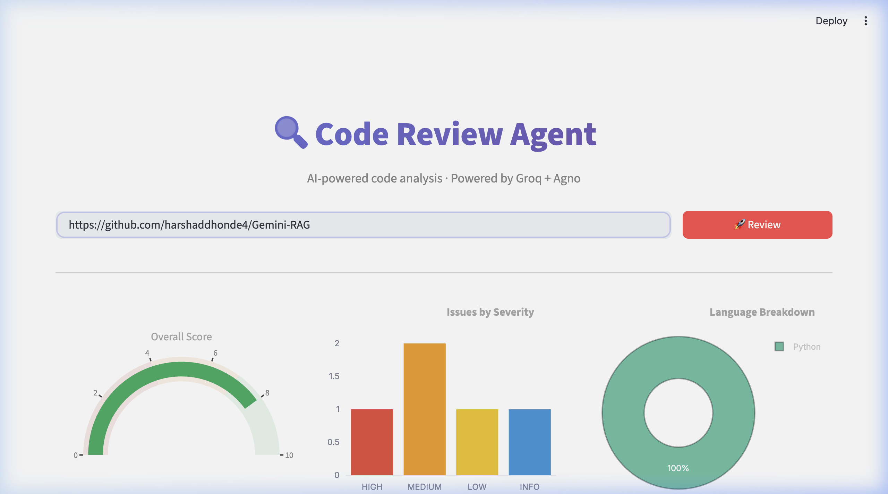
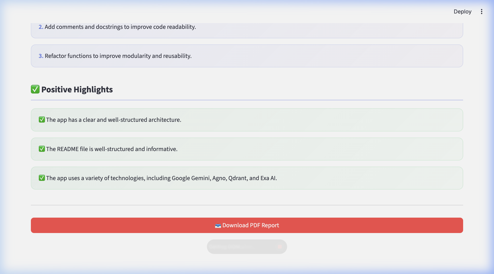
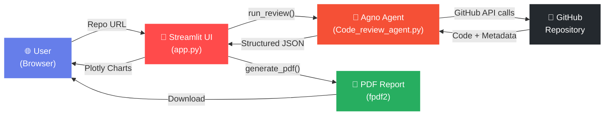

<p align="center">
  
  
  
</p>

<h1 align="center">
  🔍 Code Review Agent
</h1>

<p align="center">
  <strong>AI-powered code review that thinks like a senior engineer.</strong><br/>
  Analyze any GitHub repository in seconds — get actionable findings, severity-rated issues, and a beautiful PDF report.
</p>

<p align="center">
  
  
  
  
</p>

<br/>

<p align="center">
  
</p>

---

## ✨ Features

<table>
<tr>
<td width="50%">

### 🤖 Intelligent Analysis
- Reviews any **public GitHub repository** in seconds
- Powered by **Groq's LLaMA 3.1** via the **Agno** agent framework
- Examines code quality, security, performance, best practices & documentation
- Returns structured JSON with severity-rated findings

</td>
<td width="50%">

### 📊 Beautiful Dashboard
- **Score Gauge** — radial indicator color-coded by quality
- **Severity Bar Chart** — visual breakdown of HIGH / MEDIUM / LOW / INFO issues
- **Language Pie Chart** — donut chart of repository languages
- **Tabbed Findings** — per-category expandable sections with color-coded badges

</td>
</tr>
<tr>
<td width="50%">

### 📥 PDF Report Generation
- Download a **professionally styled PDF** with one click
- Colored header banner, metrics cards & severity-coded finding cards
- Themed recommendations (purple) and highlights (green) sections
- Auto-saved to local `reports/` folder as backup

</td>
<td width="50%">

### 🛡️ Production Ready
- Graceful error handling for API rate limits & invalid responses
- Unicode text sanitization for cross-platform PDF compatibility
- Session state persistence — results survive page refreshes
- CLI mode available for headless / CI environments

</td>
</tr>
</table>

---

## 🖼️ Screenshots

<details>
<summary><strong>📊 Dashboard — Charts & Visualizations</strong></summary>
<br/>
<p align="center">
  
</p>
<p align="center"><em>Score gauge, severity distribution, and language breakdown rendered with Plotly.</em></p>
</details>

<details>
<summary><strong>📥 PDF Download & Highlights</strong></summary>
<br/>
<p align="center">
  
</p>
<p align="center"><em>Recommendations, positive highlights, and one-click PDF download.</em></p>
</details>

---

## 🏗️ Architecture



### How It Works

1. **You paste** a GitHub repository URL into the Streamlit dashboard
2. **The Agno Agent** (powered by Groq's LLaMA 3.1) connects to GitHub's API
3. **It reads** the repository structure, key source files, and metadata
4. **It generates** a structured JSON report with severity-rated findings
5. **The dashboard** renders interactive Plotly charts and tabbed findings
6. **You download** a beautiful PDF report styled to match the dashboard

---

## 🚀 Quick Start

### Prerequisites

| Requirement | Purpose |
|---|---|
| **Python 3.10+** | Runtime |
| **Groq API Key** | LLM inference ([get one free](https://console.groq.com)) |
| **GitHub Token** *(optional)* | Higher API rate limits ([create one](https://github.com/settings/tokens)) |

### Installation

```bash
# 1. Clone the repository
git clone https://github.com/harshaddhonde4/Code_Review_Agent.git
cd Code_Review_Agent

# 2. Install dependencies
pip install -r requirements.txt

# 3. Set up environment variables
cp .env.example .env
# Edit .env and add your API keys
```

### Configuration

Create a `.env` file in the project root:

```env
GROQ_API_KEY=your_groq_api_key_here
GITHUB_TOKEN=your_github_token_here   # optional but recommended
```

### Run the Dashboard

```bash
streamlit run app.py
```

Open **http://localhost:8501** in your browser, paste any GitHub repo URL, and click **🚀 Review**.

### Run via CLI (Headless)

```bash
python Code_review_agent.py https://github.com/owner/repo
```

This generates a Markdown report in the `reports/` folder.

---

## 📁 Project Structure

```
📦 Gemini-RAG/
├── 🎨 app.py                  # Streamlit UI + Plotly charts + PDF generation
├── 🤖 Code_review_agent.py    # Agno agent + Groq LLM + GitHub tools
├── 📋 requirements.txt        # Python dependencies
├── 🔒 .env                    # API keys (gitignored)
├── 🚫 .gitignore              # Excludes secrets, cache, test files
├── 📂 reports/                 # Generated reports (gitignored)
├── 🖼️ assets/                 # Screenshots for README
│   ├── dashboard.png
│   └── pdf_download.png
└── 📖 README.md               # You are here
```

---

## 🧰 Tech Stack

<p align="center">

| Technology | Role | Why |
|:---:|:---:|:---|
|  | Agent Orchestration | Clean tool-calling abstraction over LLMs |
|  | AI Engine | Ultra-fast inference on LLaMA 3.1 |
|  | Dashboard | Rapid data app development |
|  | Charts | Interactive gauge, bar & pie charts |
|  | Reports | Styled PDF with colored cards & typography |
|  | Data Source | Repository analysis via REST API |

</p>

---

## 📋 Review Categories

The agent evaluates repositories across **5 dimensions**:

| Category | What It Checks |
|---|---|
| 🧹 **Code Quality** | Readability, complexity, naming conventions, DRY violations |
| 🛡️ **Security** | Hardcoded secrets, injection risks, unsafe dependencies |
| ⚡ **Performance** | Algorithmic inefficiency, memory leaks, redundant operations |
| 📐 **Best Practices** | Design patterns, error handling, testing coverage |
| 📝 **Documentation** | README quality, inline comments, docstrings, type hints |

Each finding includes:
- **Severity** — `HIGH` · `MEDIUM` · `LOW` · `INFO`
- **File & Line** — exact location in the codebase
- **Issue** — what's wrong
- **Suggestion** — how to fix it

---

## 🎯 Roadmap

- [x] AI-powered repository analysis
- [x] Interactive Streamlit dashboard
- [x] Plotly visualizations (gauge, bar, pie)
- [x] Severity-coded finding cards
- [x] PDF report generation
- [x] CLI mode for headless usage
- [ ] Multi-repo batch analysis
- [ ] GitHub Actions integration
- [ ] PR-level diff review
- [ ] Custom rule configuration
- [ ] Historical trend tracking

---

## 🤝 Contributing

Contributions are welcome! Here's how:

1. **Fork** the repository
2. **Create** a feature branch (`git checkout -b feature/amazing-feature`)
3. **Commit** your changes (`git commit -m 'Add amazing feature'`)
4. **Push** to the branch (`git push origin feature/amazing-feature`)
5. **Open** a Pull Request

---

## 📄 License

This project is licensed under the **MIT License** — see the [LICENSE](LICENSE) file for details.

---

## 🙏 Acknowledgements

- [**Agno**](https://github.com/agno-agi/agno) — The agent framework that makes tool-calling elegant
- [**Groq**](https://groq.com) — Lightning-fast LLM inference
- [**Streamlit**](https://streamlit.io) — The fastest way to build data apps
- [**Plotly**](https://plotly.com) — Interactive visualizations
- [**Krish Naik**](https://www.youtube.com/@krishnaik06) — Inspiration & learning resources

---

<p align="center">
  <strong>Built with ❤️ by <a href="https://github.com/harshaddhonde4">Harshad Dhonde</a></strong>
</p>

<p align="center">
  <a href="https://github.com/harshaddhonde4/Gemini-RAG/stargazers">⭐ Star this repo</a> if you found it useful!
</p>
